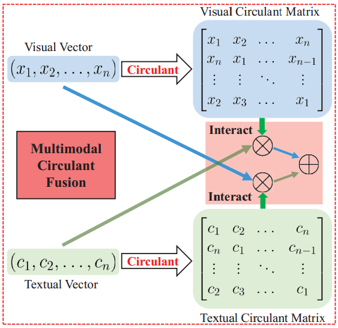

# Multi-modal-Circulant-Fusion

This repository is the source code of `Multi-modal Circulant Fusion (MCF) for Temporal Activity Localization`

- The flowchart of Multimodal Circulant Fusion (MCF).

- The architecture with MCF for temporal activity localization via language query.

