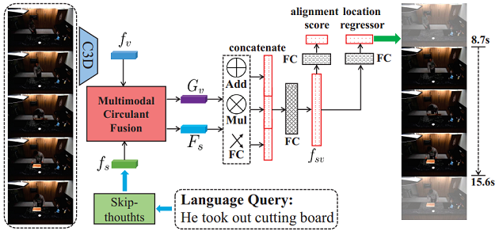

# Multi-modal-Circulant-Fusion

This repository is the source code of `Multi-modal Circulant Fusion (MCF) for Temporal Activity Localization`

- The flowchart of Multimodal Circulant Fusion (MCF).


- The architecture with MCF for temporal activity localization via language query.



## Train

```
python main.py
```

## Examples
- Examples of regression results on TACoS. The gray row shows the ground truth for the given query. The blue row shows the prediction of CTRL. The green row shows the prediction of our method.


